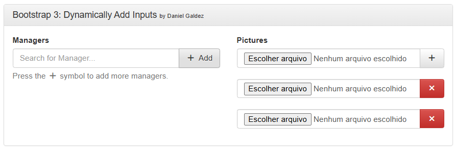

# Bootstrap Dynamic Input Plugin

This project is a custom plugin for the Bootstrap framework that allows the creation of styled buttons to dynamically add input fields into a container. It enables the easy addition of extra fields in forms, optimizing space and enhancing user interface interactivity.

This plugin was developed by **Daniel Campos Galdez** and has been successfully used in real systems for the regional electoral court.

## Features

- **Bootstrap-Compatible:** Seamlessly integrates with the Bootstrap framework.
- **Customizable Styling:** Buttons can be styled to match the design of your project.
- **Dynamic Inputs:** Easily add multiple input fields in an efficient and user-friendly way.
- **Support for Multiple Input Types:** Can add text, email, number inputs, and more, depending on configuration.

## Live Demo

Access the [Live Demo here](https://danielkgm.github.io/bootstrap-dinamicaly-add-inputs/) to see the plugin in action.
